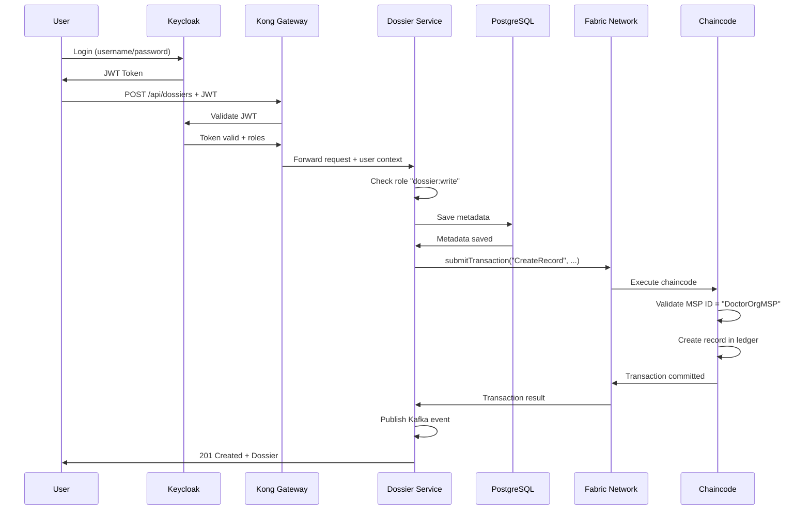

# Liaison entre Hyperledger Fabric et les Services Backend

## Vue d'ensemble

Ce document explique comment l'architecture **Hyperledger Fabric** est intégrée avec les **microservices backend** dans le projet MedInsight. Il détaille les mécanismes de communication, les flux de données, et les composants clés de cette intégration.

---

## 📋 Table des Matières

1. [Architecture Globale](#architecture-globale)
2. [Composants Fabric](#composants-fabric)
3. [Composants Backend](#composants-backend)
4. [Mécanisme de Liaison](#mécanisme-de-liaison)
5. [Flux de Données](#flux-de-données)
6. [Configuration Détaillée](#configuration-détaillée)
7. [Exemples d'Intégration](#exemples-dintégration)
8. [Sécurité et Contrôle d'Accès](#sécurité-et-contrôle-daccès)

---

## 1. Architecture Globale

```
┌─────────────────────────────────────────────────────────────────┐
│                      COUCHE APPLICATION                          │
│  ┌──────────────┐  ┌──────────────┐  ┌──────────────┐          │
│  │   Frontend   │  │   API Gateway │  │   Keycloak   │          │
│  │   (React)    │  │    (Kong)     │  │    (Auth)    │          │
│  └──────────────┘  └──────────────┘  └──────────────┘          │
└─────────────────────────────────────────────────────────────────┘
                              ↓
┌─────────────────────────────────────────────────────────────────┐
│                   COUCHE MICROSERVICES                           │
│  ┌──────────────┐  ┌──────────────┐  ┌──────────────┐          │
│  │   Dossier    │  │     Lab      │  │ Ordonnance   │          │
│  │   Service    │  │   Service    │  │   Service    │          │
│  │  (Port 8083) │  │  (Port 8081) │  │  (Port 8082) │          │
│  └──────┬───────┘  └──────┬───────┘  └──────┬───────┘          │
│         │                 │                  │                   │
│         │    ┌────────────┴──────────────┐   │                   │
│         │    │      Kafka (Events)       │   │                   │
│         │    └───────────────────────────┘   │                   │
│         │                                     │                   │
│         ├─────────────────────────────────────┤                   │
│         │        PostgreSQL (Metadata)        │                   │
│         └─────────────────────────────────────┘                   │
└─────────────────────────────────────────────────────────────────┘
                              ↓
┌─────────────────────────────────────────────────────────────────┐
│              COUCHE BLOCKCHAIN (Hyperledger Fabric)              │
│                                                                   │
│  ┌─────────────────────────────────────────────────────────┐   │
│  │                    Fabric Network                        │   │
│  │                                                           │   │
│  │  ┌──────────────┐  ┌──────────────┐  ┌──────────────┐  │   │
│  │  │  DoctorOrg   │  │  PharmacyOrg │  │  PatientOrg  │  │   │
│  │  │  Peer Node   │  │  Peer Node   │  │  Peer Node   │  │   │
│  │  └──────────────┘  └──────────────┘  └──────────────┘  │   │
│  │                                                           │   │
│  │  ┌───────────────────────────────────────────────────┐  │   │
│  │  │              Orderer Service                       │  │   │
│  │  └───────────────────────────────────────────────────┘  │   │
│  │                                                           │   │
│  │  Channels:                                               │   │
│  │  • recordschannel    → medical-records chaincode        │   │
│  │  • consentchannel    → consent chaincode                │   │
│  │  • prescriptionschannel → prescriptions chaincode       │   │
│  └─────────────────────────────────────────────────────────┘   │
└─────────────────────────────────────────────────────────────────┘
```

---

## 2. Composants Fabric

### 2.1 Organisations

Le réseau Fabric est composé de **4 organisations** :

| Organisation | MSP ID | Peer | CA | Rôle |
|-------------|--------|------|-----|------|
| **DoctorOrg** | `DoctorOrgMSP` | `peer0.doctor.medinsight.com:7051` | `ca.doctor.medinsight.com:7054` | Créer/Modifier les dossiers médicaux |
| **PharmacyOrg** | `PharmacyOrgMSP` | `peer0.pharmacy.medinsight.com:9051` | `ca.pharmacy.medinsight.com:8054` | Dispenser les prescriptions |
| **LabOrg** | `LabOrgMSP` | `peer0.lab.medinsight.com:11051` | `ca.lab.medinsight.com:9054` | Gérer les analyses de laboratoire |
| **PatientOrg** | `PatientOrgMSP` | `peer0.patient.medinsight.com:13051` | `ca.patient.medinsight.com:10054` | Gérer les consentements et consulter les dossiers |

### 2.2 Channels et Chaincodes

| Channel | Chaincode | Fonctions Principales | Organisations |
|---------|-----------|----------------------|---------------|
| **recordschannel** | `medical-records` | CreateRecord, ReadRecord, UpdateRecord, QueryRecordsByPatient | DoctorOrg, PatientOrg |
| **consentchannel** | `consent` | GrantConsent, RevokeConsent, CheckConsent | Toutes |
| **prescriptionschannel** | `prescriptions` | CreatePrescription, DispensePrescription | DoctorOrg, PharmacyOrg |

### 2.3 Fichiers de Configuration Fabric

Chaque organisation a un **Connection Profile** JSON qui définit :
- Les endpoints des peers
- Les certificats TLS
- Les autorités de certification (CA)
- Les configurations réseau

**Exemple** : `connection-doctor.json`
```json
{
  "name": "medinsight-network-doctor",
  "version": "1.0.0",
  "client": {
    "organization": "doctor"
  },
  "organizations": {
    "doctor": {
      "mspid": "DoctorOrgMSP",
      "peers": ["peer0.doctor.medinsight.com"],
      "certificateAuthorities": ["ca.doctor.medinsight.com"]
    }
  },
  "peers": {
    "peer0.doctor.medinsight.com": {
      "url": "grpcs://localhost:7051",
      "tlsCACerts": { ... }
    }
  }
}
```

---

## 3. Composants Backend

### 3.1 Services Intégrés avec Fabric

Deux services principaux utilisent Fabric :

#### **dossier-service** (Port 8083)
- **Rôle** : Gestion des dossiers médicaux
- **Organisation Fabric** : DoctorOrg
- **Channel** : recordschannel
- **Chaincode** : medical-records
- **Wallet** : `dossierAppUser` (identité Fabric)

#### **lab-service** (Port 8081)
- **Rôle** : Gestion des analyses de laboratoire
- **Organisation Fabric** : LabOrg (ou DoctorOrg selon config)
- **Channel** : recordschannel
- **Chaincode** : medical-records
- **Wallet** : `labAppUser`

### 3.2 Stack Technologique Backend

- **Framework** : Spring Boot 3.2.0
- **Langage** : Java 17
- **Base de données** : PostgreSQL (métadonnées)
- **Messaging** : Apache Kafka
- **Blockchain SDK** : Hyperledger Fabric Gateway Java SDK 2.2.9
- **Authentification** : Keycloak

---

## 4. Mécanisme de Liaison

### 4.1 Configuration Docker

Dans `docker-compose.yml`, les services sont configurés pour accéder au réseau Fabric :

```yaml
dossier-service:
  build:
    context: ./dossier-service
  ports:
    - "8083:8080"
  environment:
    # Configuration Fabric
    FABRIC_WALLET_PATH: /app/wallet
    FABRIC_CONNECTION_PROFILE: /app/connection-doctor.json
  volumes:
    # Montage du profil de connexion Fabric
    - ../fabric-network/connection-doctor.json:/app/connection-doctor.json
    # Montage du wallet (identité cryptographique)
    - ../fabric-network/wallets/doctor/dossierAppUser:/app/wallet
  networks:
    - medinsight-net
    - fabric-net  # ⚠️ Réseau partagé avec Fabric
```

**Points clés** :
1. **Volumes montés** : Le service accède aux fichiers Fabric via des volumes Docker
2. **Réseau partagé** : `fabric-net` permet la communication avec les peers Fabric
3. **Variables d'environnement** : Configurent les chemins vers le wallet et le profil

### 4.2 Configuration Spring Boot

Dans `application.properties` :

```properties
# Hyperledger Fabric Configuration
fabric.walletPath=wallet
fabric.connectionProfile=connection-doctor.json
fabric.userName=dossierAppUser
fabric.channelName=recordschannel
fabric.contractName=medical-records
```

### 4.3 Configuration Java (FabricConfig.java)

Le service utilise le **Fabric Gateway SDK** pour se connecter :

```java
@Configuration
public class FabricConfig {
    
    @Value("${fabric.walletPath}")
    private String walletPath;
    
    @Value("${fabric.connectionProfile}")
    private String connectionProfile;
    
    @Value("${fabric.userName}")
    private String userName;
    
    @Value("${fabric.channelName}")
    private String channelName;
    
    @Value("${fabric.contractName}")
    private String contractName;
    
    // 1️⃣ Créer le Wallet (identités cryptographiques)
    @Bean
    public Wallet wallet() throws IOException {
        return Wallets.newFileSystemWallet(Paths.get(walletPath));
    }
    
    // 2️⃣ Créer la Gateway (connexion au réseau Fabric)
    @Bean
    public Gateway gateway(Wallet wallet) throws IOException {
        Path networkConfigPath = Paths.get(connectionProfile);
        
        Gateway.Builder builder = Gateway.createBuilder();
        builder.identity(wallet, userName)
               .networkConfig(networkConfigPath)
               .discovery(true);  // Service discovery automatique
        
        return builder.connect();
    }
    
    // 3️⃣ Accéder au Network (channel)
    @Bean
    public Network network(Gateway gateway) {
        return gateway.getNetwork(channelName);
    }
    
    // 4️⃣ Accéder au Contract (chaincode)
    @Bean
    public Contract contract(Network network) {
        return network.getContract(contractName);
    }
}
```

**Flux de connexion** :
```
Wallet → Gateway → Network (Channel) → Contract (Chaincode)
```

---

## 5. Flux de Données

### 5.1 Exemple : Création d'un Dossier Médical

```
┌──────────┐      ┌──────────────┐      ┌──────────────┐      ┌──────────────┐
│  Client  │      │   Dossier    │      │  PostgreSQL  │      │    Fabric    │
│ (Frontend)│      │   Service    │      │  (Metadata)  │      │   Network    │
└────┬─────┘      └──────┬───────┘      └──────┬───────┘      └──────┬───────┘
     │                   │                      │                      │
     │ POST /api/dossiers│                      │                      │
     ├──────────────────>│                      │                      │
     │                   │                      │                      │
     │                   │ 1. Validation JWT    │                      │
     │                   │    (Keycloak)        │                      │
     │                   │                      │                      │
     │                   │ 2. Save metadata     │                      │
     │                   ├─────────────────────>│                      │
     │                   │ <─────────────────────┤                      │
     │                   │                      │                      │
     │                   │ 3. submitTransaction("CreateRecord", ...)   │
     │                   ├────────────────────────────────────────────>│
     │                   │                      │                      │
     │                   │                      │    4. Chaincode      │
     │                   │                      │       Execution      │
     │                   │                      │    (Validation MSP)  │
     │                   │                      │                      │
     │                   │ 5. Transaction committed                    │
     │                   │ <────────────────────────────────────────────┤
     │                   │                      │                      │
     │                   │ 6. Publish Kafka event                      │
     │                   │ (dossier.created)    │                      │
     │                   │                      │                      │
     │ 200 OK + Dossier  │                      │                      │
     │ <──────────────────┤                      │                      │
     │                   │                      │                      │
```

### 5.2 Code d'Exemple (Hypothétique)

**Note** : Le code actuel dans `DossierController.java` n'utilise **PAS ENCORE** Fabric directement. Voici comment il **devrait** être implémenté :

```java
@RestController
@RequestMapping("/api/dossiers")
@RequiredArgsConstructor
public class DossierController {
    
    private final DossierRepository repo;
    private final Contract fabricContract;  // ← Injecté depuis FabricConfig
    private final KafkaProducerService producerService;
    
    @PostMapping
    public ResponseEntity<?> create(@RequestBody Dossier dossier) {
        // 1. Validation des permissions
        if (!UserContext.getCurrent().hasRole("dossier:write")) {
            return ResponseEntity.status(HttpStatus.FORBIDDEN)
                .body("Access Denied");
        }
        
        // 2. Générer un ID unique
        if (dossier.getId() == null) {
            dossier.setId(UUID.randomUUID().toString());
        }
        
        // 3. Sauvegarder les métadonnées dans PostgreSQL
        Dossier saved = repo.save(dossier);
        
        // 4. Enregistrer dans Fabric Blockchain
        try {
            fabricContract.submitTransaction(
                "CreateRecord",
                saved.getId(),
                saved.getPatientId(),
                saved.getDoctorId(),
                saved.getDiagnosis(),
                saved.getTreatment(),
                toJson(saved.getMedications()),
                saved.getLabResults(),
                saved.getNotes()
            );
        } catch (Exception e) {
            // Rollback ou compensation
            repo.delete(saved);
            return ResponseEntity.status(HttpStatus.INTERNAL_SERVER_ERROR)
                .body("Failed to record in blockchain: " + e.getMessage());
        }
        
        // 5. Publier un événement Kafka
        producerService.sendDossierCreated("dossier.created", saved);
        
        return ResponseEntity.status(HttpStatus.CREATED).body(saved);
    }
    
    @GetMapping("/{id}")
    public ResponseEntity<?> getById(@PathVariable String id) {
        try {
            // Lire depuis Fabric (source de vérité)
            byte[] result = fabricContract.evaluateTransaction("ReadRecord", id);
            MedicalRecord record = objectMapper.readValue(result, MedicalRecord.class);
            
            return ResponseEntity.ok(record);
        } catch (Exception e) {
            return ResponseEntity.status(HttpStatus.NOT_FOUND)
                .body("Record not found: " + e.getMessage());
        }
    }
}
```

---

## 6. Configuration Détaillée

### 6.1 Dépendances Maven (pom.xml)

```xml
<dependencies>
    <!-- Spring Boot -->
    <dependency>
        <groupId>org.springframework.boot</groupId>
        <artifactId>spring-boot-starter-web</artifactId>
    </dependency>
    
    <!-- PostgreSQL -->
    <dependency>
        <groupId>org.springframework.boot</groupId>
        <artifactId>spring-boot-starter-data-jpa</artifactId>
    </dependency>
    <dependency>
        <groupId>org.postgresql</groupId>
        <artifactId>postgresql</artifactId>
    </dependency>
    
    <!-- Kafka -->
    <dependency>
        <groupId>org.springframework.kafka</groupId>
        <artifactId>spring-kafka</artifactId>
    </dependency>
    
    <!-- ⭐ Hyperledger Fabric Gateway SDK -->
    <dependency>
        <groupId>org.hyperledger.fabric</groupId>
        <artifactId>fabric-gateway-java</artifactId>
        <version>2.2.9</version>
    </dependency>
</dependencies>
```

### 6.2 Structure des Wallets

Les wallets contiennent les **identités cryptographiques** (certificats X.509) :

```
fabric-network/wallets/
├── doctor/
│   └── dossierAppUser/
│       ├── dossierAppUser.id       # Identité complète
│       ├── certificate.pem         # Certificat public
│       └── privateKey.pem          # Clé privée
├── lab/
│   └── labAppUser/
│       └── ...
└── patient/
    └── patientAppUser/
        └── ...
```

Ces fichiers sont générés par les **Certificate Authorities (CA)** Fabric lors de l'enregistrement des utilisateurs.

### 6.3 Réseau Docker

Le réseau `fabric-net` est **externe** et créé par `docker-compose-fabric.yml` :

```yaml
# Dans docker-compose.yml (microservices)
networks:
  medinsight-net:
    driver: bridge
  fabric-net:
    external: true      # ← Créé par Fabric
    name: fabric-net
```

```yaml
# Dans docker-compose-fabric.yml (Fabric network)
networks:
  fabric-net:
    name: fabric-net
```

---

## 7. Exemples d'Intégration

### 7.1 Méthodes du Chaincode `medical-records`

| Fonction | Type | Paramètres | Description |
|----------|------|------------|-------------|
| `CreateRecord` | Transaction | recordID, patientID, doctorID, diagnosis, treatment, medications, labResults, notes | Crée un nouveau dossier médical |
| `ReadRecord` | Query | recordID | Lit un dossier existant |
| `UpdateRecord` | Transaction | recordID, diagnosis, treatment, medications, labResults, notes | Met à jour un dossier |
| `DeleteRecord` | Transaction | recordID | Supprime un dossier |
| `QueryRecordsByPatient` | Query | patientID | Récupère tous les dossiers d'un patient |

### 7.2 Appel depuis Java

**Transaction (modifie l'état)** :
```java
byte[] result = contract.submitTransaction(
    "CreateRecord",
    "REC001",
    "PAT001",
    "DOC001",
    "Hypertension",
    "Medication",
    "[\"Lisinopril 10mg\"]",
    "BP: 140/90",
    "Patient advised..."
);
```

**Query (lecture seule)** :
```java
byte[] result = contract.evaluateTransaction(
    "ReadRecord",
    "REC001"
);
MedicalRecord record = objectMapper.readValue(result, MedicalRecord.class);
```

### 7.3 Gestion des Erreurs

```java
try {
    contract.submitTransaction("CreateRecord", ...);
} catch (TimeoutException e) {
    // Transaction timeout
    log.error("Fabric transaction timeout", e);
} catch (ContractException e) {
    // Chaincode error (e.g., permission denied)
    log.error("Chaincode error: {}", e.getMessage());
} catch (Exception e) {
    // Network error
    log.error("Fabric network error", e);
}
```

---

## 8. Sécurité et Contrôle d'Accès

### 8.1 Contrôle d'Accès Multi-Niveaux

| Niveau | Mécanisme | Exemple |
|--------|-----------|---------|
| **1. API Gateway** | Kong + JWT | Authentification utilisateur |
| **2. Microservice** | Keycloak Roles | `dossier:write`, `dossier:read` |
| **3. Fabric MSP** | Membership Service Provider | `DoctorOrgMSP`, `PatientOrgMSP` |
| **4. Chaincode** | Business Logic | Seuls les docteurs peuvent créer des dossiers |

### 8.2 Exemple de Validation Chaincode

Dans `medical-records/main.go` :

```go
func (c *MedicalRecordsContract) CreateRecord(ctx contractapi.TransactionContextInterface, ...) error {
    // Récupérer l'identité de l'appelant
    mspID, err := ctx.GetClientIdentity().GetMSPID()
    if err != nil {
        return fmt.Errorf("failed to get MSP ID: %v", err)
    }
    
    // Vérifier que c'est un docteur
    if mspID != "DoctorOrgMSP" {
        return fmt.Errorf("only doctors can create medical records")
    }
    
    // Continuer avec la création...
}
```

### 8.3 Flux d'Authentification Complet

```
1. Utilisateur → Keycloak : Login
2. Keycloak → Utilisateur : JWT Token
3. Utilisateur → Kong Gateway : Request + JWT
4. Kong → Keycloak : Validate JWT
5. Kong → Microservice : Forward request + User context
6. Microservice → Fabric : submitTransaction avec identité Fabric
7. Fabric Peer → Chaincode : Validate MSP ID
8. Chaincode : Execute business logic
9. Fabric → Microservice : Transaction result
10. Microservice → Utilisateur : Response
```

---

## 9. Diagramme de Séquence Complet



---

## 10. Points Clés à Retenir

### ✅ Avantages de l'Architecture

1. **Immutabilité** : Les données Fabric ne peuvent pas être modifiées rétroactivement
2. **Traçabilité** : Chaque transaction est enregistrée avec son créateur (MSP ID)
3. **Décentralisation** : Plusieurs organisations partagent le réseau
4. **Sécurité** : Contrôle d'accès à plusieurs niveaux
5. **Auditabilité** : Historique complet des modifications

### ⚠️ Limitations Actuelles

1. **Implémentation incomplète** : Le code actuel de `DossierController` n'utilise pas encore Fabric
2. **Pas de TLS** : Le réseau Fabric est en mode développement (TLS désactivé)
3. **Consensus simple** : Orderer Solo (non adapté à la production)
4. **Pas de gestion des erreurs** : Manque de rollback/compensation

### 🚀 Prochaines Étapes

1. Implémenter les appels Fabric dans les contrôleurs
2. Ajouter la gestion des transactions distribuées
3. Activer TLS pour la production
4. Migrer vers Raft consensus
5. Implémenter le chaincode `consent` et `prescriptions`
6. Ajouter Hyperledger Explorer pour la visualisation

---

## 11. Ressources

- **Documentation Fabric** : https://hyperledger-fabric.readthedocs.io/
- **Fabric Gateway SDK** : https://github.com/hyperledger/fabric-gateway
- **Spring Boot + Fabric** : https://www.baeldung.com/hyperledger-fabric-intro
- **MedInsight Fabric Network** : `fabric-network/README.md`

---

**Auteur** : Documentation générée pour le projet MedInsight  
**Date** : 2026-01-10  
**Version** : 1.0
